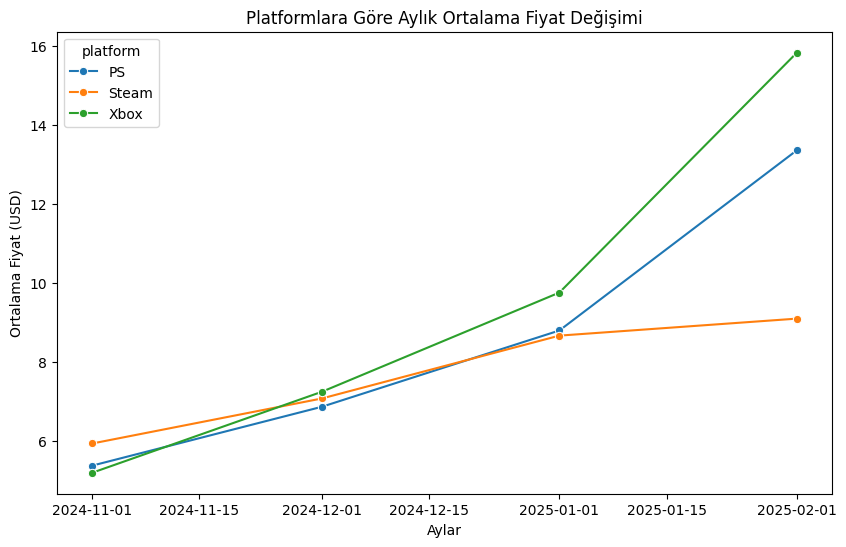
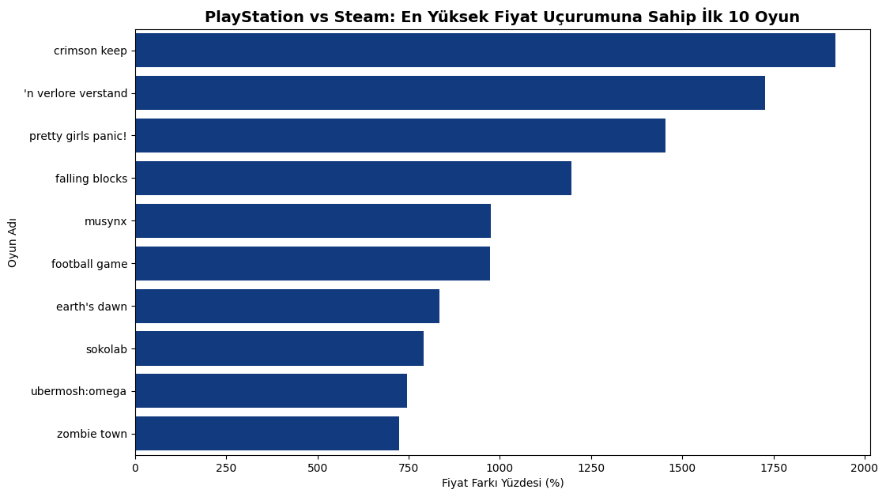
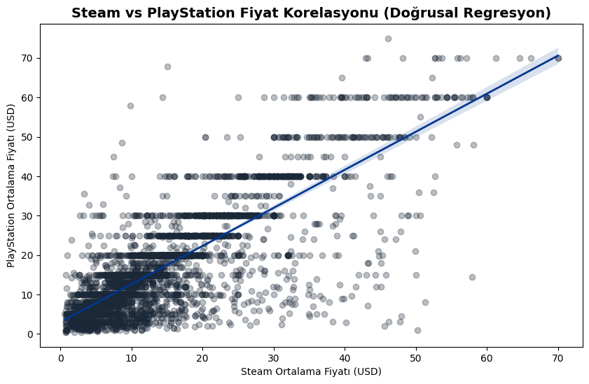
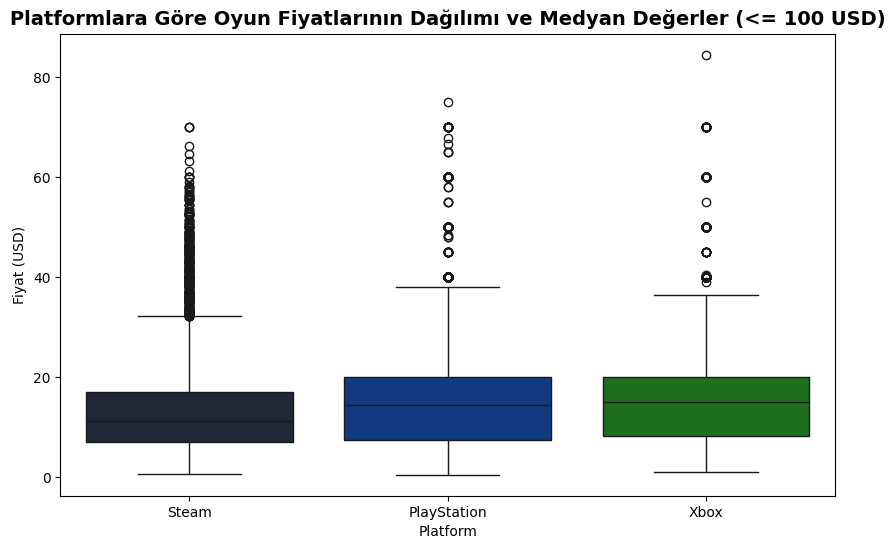

# 🎮 Oyun Fiyatlandırma Stratejileri: Steam, PlayStation ve Xbox Rekabeti

**Hazırlayan:** Bora Yüksel  
**Kullanılan Araçlar:** BigQuery (SQL), Python (Pandas, Seaborn, Matplotlib, Scikit-learn)  
**Veri Seti:** 3.5 Milyon Tarihsel Fiyat Kaydı, 3 Farklı Platform

## 📌 Projenin Amacı
Bu projede, dijital oyun pazarının en büyük 3 aktörünün (Steam, PS ve Xbox) fiyatlandırma stratejilerini ve indirim trendlerini inceledim. Amacım sadece ekrandaki güncel fiyatlara bakmak değil; geçmişe dönük zaman serisi verilerini kullanarak pazarın yazılı olmayan kurallarını (Sony'nin sabit fiyat bantları veya çapraz platform fiyat uçurumları gibi) makine öğrenmesi algoritmalarıyla kanıtlamaktı.

## 🛠️ Veri Mimarisi (SQL Pipeline)
Veriyi doğrudan analiz etmek yerine BigQuery üzerinde 3 katmanlı (Bronze, Silver, Gold) yapısal bir süreçten geçirdim:
* **Bronze Layer (Ham Veri):** Platformlardan gelen farklı şemalardaki dağınık verileri tek bir standarda oturttum.
* **Silver Layer (Temizlik & Modelleme):** 3.5 milyon satırlık verideki tekrarları sildim. PS4 ve PS5 gibi ayrılımları tek bir "PS" çatısında birleştirdim. İndirim trendlerini analiz edebilmek için eski fiyatları ezmek yerine tüm tarihsel dalgalanmaları korudum.
* **Gold Layer (Analiz Katmanı):** Ortalama fiyatlar, aylık trendler ve "Fiyat Uçurumu (Price Gap)" gibi nihai metrikleri SQL'de Pivot tablolarla hesaplayıp Python'a aktarılmaya hazır hale getirdim.

## 💡 Neler Buldum?

### 1. İndirim Yanılsaması
*Kasım ayında tüm platformlar rekabet için fiyatları eşitliyor, ama asıl hikaye indirim bitince başlıyor.*

* **Black Friday Etkisi:** Kasım ayında her üç platformda da ortalama fiyatların 5-6 dolar bandına kadar inip dibi gördüğünü saptadım.
* **Fiyatların Ayrışması:** İndirim rüzgarı geçip Şubat ayına geldiğimizde konsol fiyatları hızla fırlarken (Xbox ~15.8$, PS ~13.3$), Steam'in (~9$) çok daha yatay ve oyuncu dostu bir çizgide kaldığını görüyoruz.

### 2. Çapraz Platform "Vergisi" (Fiyat Uçurumları)
*Konsol oyuncuları, aynı oyun için bazen PC oyuncularının katbekat fazlasını ödüyor.*

* Aynı oyunları platformlar arası kıyasladığımda devasa arbitrajlar yakaladım. Örneğin *Crimson Keep* adlı bağımsız bir oyun Steam'de sadece 0.99 dolarken, konsollarda 19.99 dolara satılıyor. Arada tam **%1919** oranında bir fiyat uçurumu var! Konsol mağazaları bağımsız yayıncılara esneklik tanımıyor.

### 3. Katı Raflar vs. Özgür Pazar (Makine Öğrenmesi)
*Steam ve PS fiyatları arasında çok güçlü bir korelasyon (0.81) var, ancak pazar kuralları birbirinden tamamen farklı.*

* Kurduğum Lineer Regresyon modeli gösterdi ki; bir oyun genel olarak pahalıysa her yerde pahalı olma eğiliminde. Ancak aşağıdaki dağılım grafiğindeki (Scatter Plot) yatay çizgilere bakarsanız PS mağazasının katı kurallarını görebilirsiniz: Steam'de fiyatlar küsuratlı ve tamamen esnekken, PlayStation pazarında oyunlar mecburen Sony'nin belirlediği 10$, 20$, 30$, 60$ gibi sabit "fiyat raflarına" (bantlarına) oturtulmak zorunda kalıyor.

### 4. Ortalamalar Yanıltır: Medyan Gerçeği
*Platformların fiyat dağılımına Kutu Grafiği (Boxplot) ile baktığımızda, PC oyunculuğunun yazılım maliyeti açısından net şekilde daha ucuz olduğunu görüyoruz.*

* Uçuk fiyatlı oyunları dışarıda bıraktığımda bile Steam'in medyan (ortanca) çizgisi konsollardan bariz şekilde daha aşağıda çıkıyor. Konsollarda oyunların asıl gövdesi 10-20 dolar arasına sıkışırken, Steam çok daha alt bütçelere kadar esneyebiliyor.

## 🚀 Özetle Ne Anlama Geliyor?
* **Bağımsız Geliştiriciler (Indie) İçin:** Kitlenizi büyütmek, mikro-fiyatlandırma yapabilmek ve pazarda esnek kalabilmek için Steam açık ara en iyi ekosistem.
* **Oyuncular İçin:** Başlangıçtaki donanım masrafını denklemden çıkarırsak, uzun vadede geniş bir oyun kütüphanesi dizmek için en ucuz ve esnek liman net olarak PC (Steam) tarafıdır.
